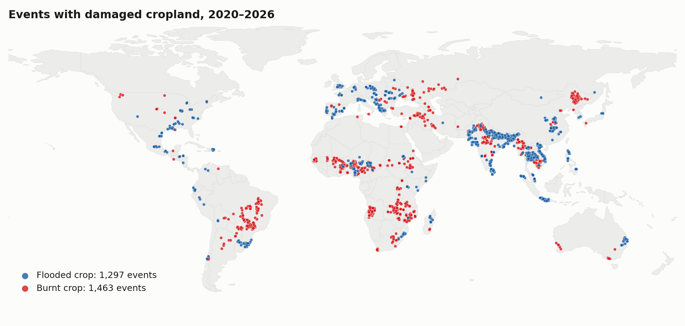
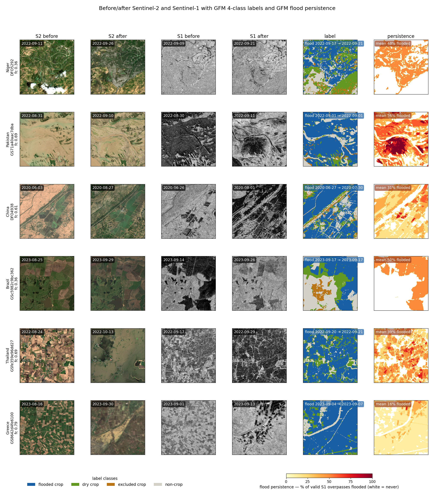
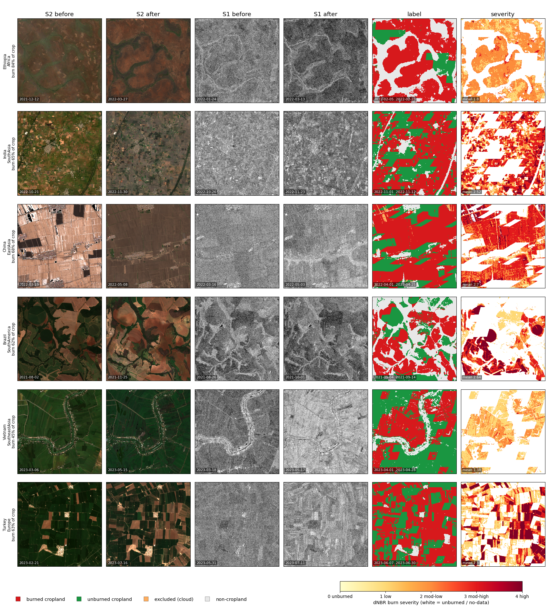
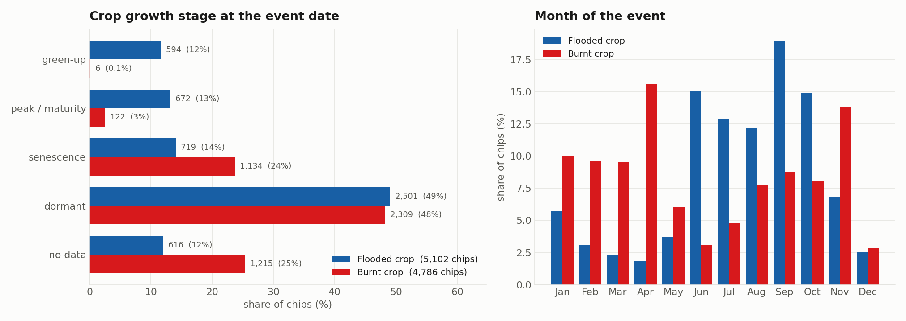
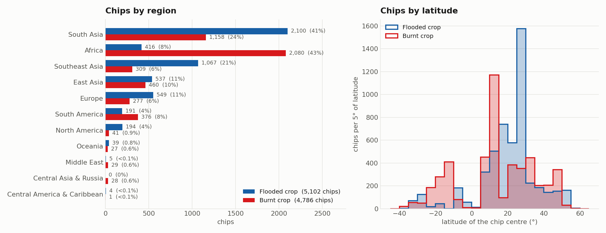
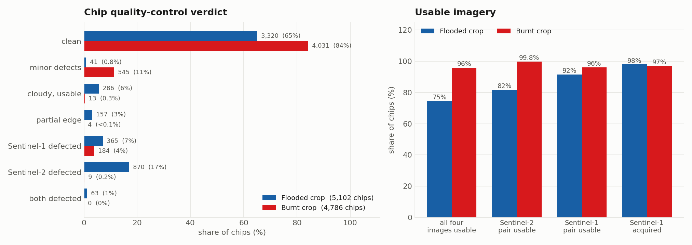

# Burnt & Flooded Crop Benchmark Data (BFC-Bench): 

### Global, Phenology-timed, Agriculutral Hazard Benchmark Data for Geosppatial Foundation Models

The following pipelines build the satellite image chips of Burnt and Flooded cropland demonstrated in https://doi.org/10.xxxx/axxxxxxxx (in preperation)
The pipelines build one folder per hazard, and include phenological stage along side quality control properties:



| folder | hazard | label source |
|:-------|:------|:------|
| [`Flooded/`](Flooded/README.md) | floods | Cross-referenced Global Flood Monitoring (GFM) flood extent on cropland |
| [`Burnt/`](Burnt/README.md) | agricultural fires | Cross-referenced Sentinel-2 dNBR inside the MODIS burned-area on cropland |

Each chip is 512 × 512 px at 10 m and comes with its label, Sentinel-2 and Sentinel-1 images from
before and after the event, the crop growth stage at the event date, and a quality-control verdict.


## Data access and citation

- **Data:** the released chips and their manifests are on Hugging Face:
  [eadrah/AgDamage_Benchmark_v1](https://huggingface.co/datasets/eadrah/AgDamage_Benchmark_v1)
- **Publication:** *title, authors, venue, year* (to be added):
  [https://doi.org/10.xxxx/axxxxxxxx](https://doi.org/10.xxxx/axxxxxxxx) (in preperation)
- **Authors:** *Esmaeel Adrah<sup>1</sup>, Julina Maharjan<sup>1</sup>, Jamon Van Den Hoek<sup>2</sup>, He Yin<sup>1,3,4</sup>*
<br><sup>1</sup> Department of Geography, Kent State University
<br><sup>2</sup> Department of Geography and Environmental Sciences, Oregon State University
<br><sup>3</sup> School of Environment, Society & Sustainability, University of Utah
<br><sup>4</sup> Scientific Computing and Imaging Institute, University of Utah
- **Contact:** *Esmaeel Adrah (eadrah@kent.edu | esmaeelad@gmail.com)*, *He Yin (he.yin@utah.edu)*


If you use this dataset or code, please cite:

```bibtex
@article{bfcbench,
  title   = {< Burnt & Flooded Crop Benchmark Data (BFC-Bench): Global, Phenology-timed, Agriculutral Hazard Benchmark Data for Geosppatial Foundation Models>},
  author  = {<Esmaeel Adrah, Julina Maharjan, Jamon Van Den Hoek, He Yin>>},
  journal = {<TBD>},
  year    = {<2026>},
  doi     = {10.xxxx/axxxxxxxx}
}
```

## Overview
[Summary](#Summary) · [Examples](#examples) · [Statistics](#statistics) ·
[Chip format](#chip-format) · [Setup](#setup) · [Running](#running)


## Summary

| | $\color{#185FA5}{\blacksquare}$ Flooded crop | $\color{#d7191c}{\blacksquare}$ Burnt crop |
|---|:--|:--|
| events in the event list | 1,952 | 1,619 |
| events with released chips | 1,297 | 1,463 |
| released chips | **5,102** | **4,786** |
| chips per event (mean) | 3.9 | 3.3 |
| event years | 2020–2026 | 2020–2025 |
| regions | 10 | 11 |
| chips with both Sentinel-1 images | 4,999 (98%) | 4,647 (97%) |
| chips with all four images usable | 3,804 (75%) | 4,593 (96%) |
| chips with a crop growth stage | 4,486 (88%) | 3,571 (75%) |

The released chips are on Hugging Face:
[eadrah/AgDamage_Benchmark_v1](https://huggingface.co/datasets/eadrah/AgDamage_Benchmark_v1).
Each hazard folder here holds its two tables:

- `manifest.csv`: one row per released chip, with its event, dates, damaged-cropland fractions,
  bounds, shard, crop growth stage and QC verdict
- `events_master.csv`: every event in the event list, including events that yielded no chips, with
  its area, dates, how it was confirmed and its chip count (the Flooded table also has the `batch`
  each event was built in)

`Flooded/excluded_chips.csv` lists the 30 chips left out of the release because both Sentinel-2
images were missing.

 

## Examples

### $\color{#185FA5}{\blacksquare}$ Flooded crop



Six chips from Niger, Pakistan, China, Brazil, Thailand and Greece, one per event. Columns: 
Sentinel-2 before and after, Sentinel-1 VV before and after, the label ($\color{#185FA5}{\blacksquare}$ flooded crop, $\color{#639922}{\blacksquare}$ dry cropland
, $\color{#BA7517}{\blacksquare}$ excluded crop, $\color{#D3D1C7}{\blacksquare}$ non-crop) and flood persistence, the share of valid Sentinel-1 overpasses in which each pixel was flooded. fc is the chip's flooded-cropland share.

### $\color{#d7191c}{\blacksquare}$ Burnt crop



Six chips from Ethiopia, India, China, Brazil, Vietnam and Turkey. Columns:
Sentinel-2 before and after, Sentinel-1 before and after, the label ($\color{#d7191c}{\blacksquare}$ burned cropland, $\color{#1a9641}{\blacksquare}$ unburned
cropland, $\color{#fdae61}{\blacksquare}$ excluded crop, $\color{#e8e8e8}{\blacksquare}$ non-cropland) and dNBR burn severity, from 0 (unburned) to 4
(high).


## Chip format

Each chip is a 512 × 512 px tile at 10 m in the event's UTM zone: five GeoTIFFs and a JSON sidecar.

| file | bands | type | content |
|:---|:--|:--|:---|
| `label` | 5 | uint8 | class and per-pixel damage layers (below) |
| `s2_pre`, `s2_post` | 12 | float32 | Sentinel-2 before / after: B2 B3 B4 B5 B6 B7 B8 B8A B9 B11 B12 (surface reflectance × 10,000) and NDVI |
| `s1_pre`, `s1_post` | 2 | float32 | Sentinel-1 before / after: VV and VH backscatter (dB) |
| `json` | | | sidecar metadata |

Image pixels with no data are 0. The pipelines write the files as `<chip>_label.tif`,
`<chip>_s2_pre.tif`, … and `<chip>.json`; in the released shards they are `<chip>.label.tif`,
`<chip>.s2_pre.tif`, … and `<chip>.json`. Chip ids are `<event>_r<row>_c<col>`.

### Label

Band 1 holds the class:

| value (band 1) | $\color{#185FA5}{\blacksquare}$ Flooded crop label | $\color{#d7191c}{\blacksquare}$ Burnt crop label |
|:--|:---|:---|
| 1 | $\color{#185FA5}{\blacksquare}$ flooded cropland | $\color{#d7191c}{\blacksquare}$ burned cropland |
| 2 | $\color{#639922}{\blacksquare}$ dry cropland | $\color{#1a9641}{\blacksquare}$ unburned cropland |
| 3 | $\color{#BA7517}{\blacksquare}$ excluded cropland: inside the GFM exclusion mask | $\color{#fdae61}{\blacksquare}$ excluded cropland: no clear Sentinel-2 view before and after |
| 4 | $\color{#D3D1C7}{\blacksquare}$ non-cropland | $\color{#e8e8e8}{\blacksquare}$ non-cropland |
| 255 | cropland never observed in label data | cropland never observed in label data |

and bands 2–5 describe each pixel:

| band | $\color{#185FA5}{\blacksquare}$ Flooded crop label | $\color{#d7191c}{\blacksquare}$ Burnt crop label |
|:--|:---|:---|
| 2 | GFM flood likelihood, 0–100; 255 = not observed | dNBR, stored as (dNBR + 500) / 8; 255 = not observed |
| 3 | GFM exclusion mask (1 = excluded) | excluded-cropland mask (0/1) |
| 4 | cropland (0/1) | cropland (0/1) |
| 5 | flood persistence, 0–100: % of valid Sentinel-1 overpasses flooded; 255 = not observed | burn severity, 0 unburned · 1 low · 2 moderate-low · 3 moderate-high · 4 high; 255 = not observed |

A Flooded pixel is flooded cropland when GFM mapped it as flooded in any Sentinel-1 overpass in a geo-cross referenced event. A
Burnt pixel is burned cropland when it was seen clearly before and after, its dNBR is at least 100 in a geo-cross referenced event where it lies inside the MODIS MCD64A1 burned-area perimeter.

### Before and after imagery

| | $\color{#185FA5}{\blacksquare}$ Flooded crop | $\color{#d7191c}{\blacksquare}$ Burnt crop |
|:--|:---|:---|
| Sentinel-2 before | the scene clearest over the chip, 30 days before the event | clearest-first mosaic, 110 to 8 days before the first burn day |
| Sentinel-2 after | the scene clearest over the chip, 30 days after the event | clearest-first mosaic, 10 to 75 days after the last burn day |
| Sentinel-1 before | the nearest scene, 30 days before the event | nearest-first , up to 60 days before the first burn day − 5 days |
| Sentinel-1 after | the nearest scene on the same pass and orbit, 30 days after | nearest-first , up to 75 days after the last burn day + 8 days |


## Statistics


### Temporal distriubtion of the chips
##### Distribution across crop growth stages and by month at the event date



The stage comes from VIIRS VNP22Q2 land-surface phenology: the event date's position in the local
growth cycle, by majority over the chip. *No data* means the event is after 2024, beyond VNP22Q2
coverage, or no valid growth cycle covers the chip.


### Spatial distribution of the chips
##### Distribution across regions and latitude




### Chip quality



Every image of every chip is scanned for missing, empty or corrupt data, cloud and
swath-edge gaps, and the chip gets its worst defect as the verdict. An image counts as usable
unless it is corrupt, cloud-blank or cut by a severe swath edge. The
status definitions are in [`Flooded/README.md`](Flooded/README.md#04--quality-control) and
[`Burnt/README.md`](Burnt/README.md#04--quality-control).
 

### Sidecar Metadata (`<chip>.json`)

| field | content |
|:---|:---|
| `chip_id`, `event_id`, `rank` | the chip, its event, and its rank within the event, best first (Flooded counts from 0, Burnt from 1) |
| `source`, `tier`, `provenance` | source of the event and confirmation source: `confirmed_by`, `n_independent`, and the GFM flood area (Flooded) or the MODIS / VIIRS burned fractions and active-fire count (Burnt) |
| `continent`, `country`, `place` | location labels |
| `event_date_start`, `event_date_end` | the event dates: reported flood dates (Flooded), first and last burn day (Burnt) |
| `crs`, `res_m`, `size` | UTM projection, 10 m, 512 px |
| `min_lon`, `min_lat`, `max_lon`, `max_lat` | chip bounds (WGS 84) |
| `cropland_frac`, `excluded_crop_frac` | cropland share and excluded-cropland share |
| `flooded_crop_frac`, `flooded_crop_px`, `flood_persistence_mean` | Flooded: flooded-cropland share and pixel count; mean persistence over flooded cropland (%) |
| `burned_crop_frac`, `burned_crop_px`, `burn_severity_mean` | Burnt: burned-cropland share and pixel count; mean severity over burned cropland (0–4) |
| `label_path`, `imagery` | the label file; per image its `date`, `clear_frac` (Sentinel-2), `pass` and `rel_orbit` (Sentinel-1) and `path`; Burnt also records the Sentinel-2 search windows |
| `phenology` | crop growth stage at the event date (`stage_at_flood` / `stage_at_burn`), its agreement over the chip, the stage shares, the growth cycle used and its transition dates; `null` with a `phenology_note` when unavailable |
| `qc` | `verdict`, `all_rasters_ok`, `all_rasters_usable`, `s2_usable`, `s1_usable`, `n_usable_rasters`, `defects`, and the status of each image under `rasters` |
| `has_s1` | both Sentinel-1 images are present |

Example snapshots below, file paths are shortened to the file name.

<details>
<summary>🟦 Flooded crop sidecar: <code>DFO5292_r53248_c52736.json</code> (Niger, first chip of the example above)</summary>

```json
{
  "chip_id": "DFO5292_r53248_c52736",
  "event_id": "DFO5292",
  "rank": 0,
  "source": "dfo",
  "tier": "C",
  "continent": "Africa",
  "country": "Niger",
  "place": "Niger",
  "provenance": {
    "origin": "dfo",
    "confirmed_by": [
      "GFM"
    ],
    "n_independent": 1,
    "tier": "C",
    "gfm_flood_km2": 143.155
  },
  "event_date_start": "2022-09-17",
  "event_date_end": "2022-09-21",
  "crs": "EPSG:32632",
  "res_m": 10,
  "size": 512,
  "label_path": "…/DFO5292_r53248_c52736_label.tif",
  "flood_persistence_mean": 48.3,
  "cropland_frac": 0.7851,
  "flooded_crop_frac": 0.356,
  "flooded_crop_px": 93323,
  "excluded_crop_frac": 0.0745,
  "min_lon": 10.968826,
  "min_lat": 12.78406,
  "max_lon": 11.016339,
  "max_lat": 12.830689,
  "imagery": {
    "s2_pre": {
      "date": "2022-09-11",
      "clear_frac": 0.8976,
      "path": "…/DFO5292_r53248_c52736_s2_pre.tif"
    },
    "s2_post": {
      "date": "2022-09-26",
      "clear_frac": 1.0,
      "path": "…/DFO5292_r53248_c52736_s2_post.tif"
    },
    "s1_pre": {
      "date": "2022-09-09",
      "path": "…/DFO5292_r53248_c52736_s1_pre.tif",
      "pass": "ASCENDING",
      "rel_orbit": 59
    },
    "s1_post": {
      "date": "2022-09-21",
      "path": "…/DFO5292_r53248_c52736_s1_post.tif",
      "pass": "ASCENDING",
      "rel_orbit": 59
    }
  },
  "phenology": {
    "stage_at_flood": "peak/maturity",
    "stage_agreement": 0.61,
    "stage_fractions": {
      "dormant": 0.058,
      "green-up": 0.138,
      "peak/maturity": 0.61,
      "senescence": 0.193
    },
    "flood_date": "2022-09-17",
    "growth_cycle": "event-year cycle 1",
    "transitions": {
      "green_up_onset": "2022-07-12",
      "maximum": "2022-08-25",
      "senescence_onset": "2022-09-30",
      "dormancy_onset": "2022-12-03"
    },
    "n_valid_pixels": 103
  },
  "qc": {
    "all_rasters_ok": true,
    "all_rasters_usable": true,
    "s2_usable": true,
    "s1_usable": true,
    "n_usable_rasters": 4,
    "verdict": "clean",
    "defects": [],
    "rasters": {
      "s2_pre": {
        "status": "ok",
        "nodata_frac": 0.0,
        "white_frac": 0.0477
      },
      "s2_post": {
        "status": "ok",
        "nodata_frac": 0.0,
        "white_frac": 0.0
      },
      "s1_pre": {
        "status": "ok",
        "nodata_frac": 0.0
      },
      "s1_post": {
        "status": "ok",
        "nodata_frac": 0.0
      }
    }
  },
  "has_s1": true
}
```

</details>

<details>
<summary>🟥 Burnt crop sidecar: <code>MC202001224756_r0187_c0148.json</code> (India, October 2020)</summary>

```json
{
  "chip_id": "MC202001224756_r0187_c0148",
  "event_id": "MC202001224756",
  "rank": 3,
  "source": "mcd64-cluster",
  "tier": "A",
  "continent": "SouthAsia",
  "country": "India",
  "place": "India",
  "provenance": {
    "origin": "MCD64A1 burned-area clustering (GlobFire method)",
    "confirmed_by": [
      "MODIS MCD64A1",
      "VIIRS VNP64A1",
      "VIIRS VNP14A1 active fire"
    ],
    "n_independent": 2,
    "tier": "A",
    "burn_km2": 235.28,
    "modis_frac": 0.956,
    "viirs_frac": 0.905,
    "active_fire_px": 145
  },
  "event_date_start": "2020-10-14",
  "event_date_end": "2020-10-31",
  "crs": "EPSG:32643",
  "res_m": 10,
  "size": 512,
  "label_path": "…/MC202001224756_r0187_c0148_label.tif",
  "burn_severity_mean": 2.34,
  "cropland_frac": 0.9346,
  "burned_crop_frac": 0.8585,
  "burned_crop_px": 225045,
  "excluded_crop_frac": 0.0,
  "min_lon": 75.352022,
  "min_lat": 30.760139,
  "max_lon": 75.405713,
  "max_lat": 30.806494,
  "imagery": {
    "s2_pre": {
      "date": "2020-09-29",
      "clear_frac": 1,
      "path": "…/MC202001224756_r0187_c0148_s2_pre.tif"
    },
    "s2_post": {
      "date": "2020-12-08",
      "clear_frac": 1,
      "path": "…/MC202001224756_r0187_c0148_s2_post.tif"
    },
    "s1_pre": {
      "date": "2020-10-04",
      "path": "…/MC202001224756_r0187_c0148_s1_pre.tif",
      "pass": "ASCENDING",
      "rel_orbit": 100
    },
    "s1_post": {
      "date": "2020-11-09",
      "path": "…/MC202001224756_r0187_c0148_s1_post.tif",
      "pass": "ASCENDING",
      "rel_orbit": 100
    },
    "s2_pre_window": [
      "2020-06-26",
      "2020-10-06"
    ],
    "s2_post_window": [
      "2020-11-10",
      "2021-01-14"
    ]
  },
  "qc": {
    "all_rasters_ok": true,
    "all_rasters_usable": true,
    "s2_usable": true,
    "s1_usable": true,
    "n_usable_rasters": 4,
    "verdict": "clean",
    "defects": [],
    "rasters": {
      "s2_pre": {
        "status": "ok",
        "nodata_frac": 0.0,
        "white_frac": 0.0005
      },
      "s2_post": {
        "status": "ok",
        "nodata_frac": 0.0,
        "white_frac": 0.0002
      },
      "s1_pre": {
        "status": "ok",
        "nodata_frac": 0.0
      },
      "s1_post": {
        "status": "ok",
        "nodata_frac": 0.0
      }
    }
  },
  "phenology": {
    "stage_at_burn": "senescence",
    "stage_agreement": 0.629,
    "stage_fractions": {
      "dormant": 0.371,
      "senescence": 0.629
    },
    "burn_date": "2020-10-14",
    "growth_cycle": "event-year cycle 2",
    "transitions": {
      "green_up_onset": "2020-07-21",
      "maximum": "2020-08-18",
      "senescence_onset": "2020-10-06",
      "dormancy_onset": "2020-11-14"
    },
    "n_valid_pixels": 5
  },
  "has_s1": true
}
```

</details>

## Setup

```bash
conda env create -f environment.yml
conda activate agdamage
earthengine authenticate
export EE_PROJECT=<your-project-id>      # a Cloud project registered for Earth Engine
```

## Running

The scripts read and write in the folder they are run from, so run every step of a pipeline from
the same working folder, for example:

```bash
mkdir -p ~/work/burnt && cd ~/work/burnt
python /path/to/AgDamage/Burnt/01_build_events.py --n 100
python /path/to/AgDamage/Burnt/02_build_chips.py
```

The steps, options and outputs of each pipeline are in its folder's README.

## Acknowledgments


**Affiliated institutions:** 


<p align="center">
  
  &nbsp;&nbsp;&nbsp;&nbsp;
  
  &nbsp;&nbsp;&nbsp;&nbsp;
  
</p>

<p align="center">
  
</p>

**Funding:** *This research was funded by NASA Disaster Program Grant number#* (to be added).

<p align="center">
  &nbsp;&nbsp;&nbsp;&nbsp;
  
</p>
